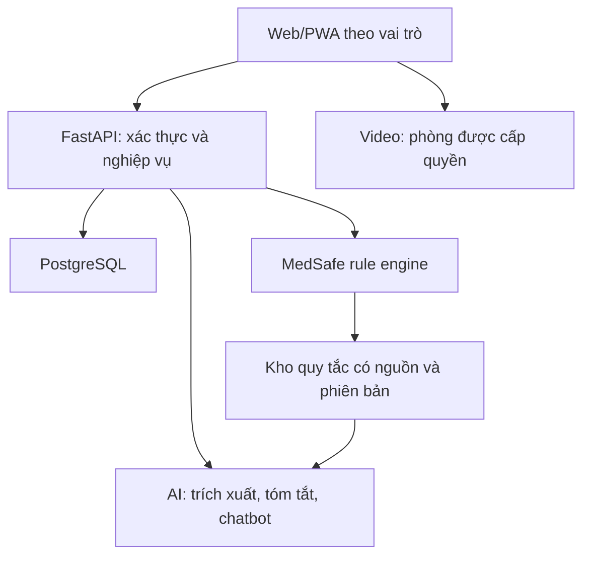

# AllerCare AI

## Nền tảng theo dõi từ xa và hỗ trợ bác sĩ sử dụng thuốc an toàn

**Lĩnh vực:** Da liễu – Miễn dịch Dị ứng.  
**Chủ đề dự thi chính:** AI giảm sai sót dùng thuốc.  
**Chức năng bổ trợ:** Theo dõi sau khám/sau xuất viện, hỗ trợ giao tiếp và tư vấn từ xa.  
**Trạng thái:** Đề xuất thiết kế MVP, chưa xác nhận có mã nguồn, triển khai hoặc kết quả đánh giá.  
**Phiên bản tài liệu:** 0.1 — 20/09/2026.

> README này là đặc tả khởi đầu để nhóm thống nhất phạm vi và phát triển sản phẩm. Các chức năng, kiến trúc, đường dẫn và API bên dưới đều là dự kiến. Đây không phải tuyên bố hệ thống đã được kiểm định hoặc được phép sử dụng trong điều trị.

## 1. Tổng quan

AllerCare AI kết nối người bệnh với bác sĩ thông qua web/app dễ sử dụng, cho phép cập nhật diễn biến bệnh, trao đổi qua chatbot giới hạn và gọi video theo lịch. Với bác sĩ, hệ thống cung cấp công cụ sàng lọc tương tác thuốc và các cảnh báo liên quan đến đặc điểm từng người bệnh.

Trọng tâm sản phẩm không phải tự động kê đơn mà là cung cấp thông tin có nguồn, đúng ngữ cảnh, để bác sĩ đánh giá trước khi quyết định dùng thuốc.

### Vấn đề cần khảo sát và xác nhận

- Thông tin thuốc đang dùng, tiền sử dị ứng và diễn biến sau khám có thể nằm ở nhiều nguồn.
- Bác sĩ cần đối chiếu danh sách thuốc với tiền sử và dữ liệu lâm sàng hiện tại.
- Người bệnh cần kênh cập nhật tình trạng và tiếp cận hướng dẫn đã được duyệt.
- Cần hạn chế câu trả lời AI không có căn cứ hoặc gây hiểu nhầm về độ an toàn của thuốc.

Các vấn đề trên là giả thuyết nghiệp vụ cần xác nhận tại khoa; chưa phải kết quả khảo sát định lượng.

## 2. Mục tiêu

1. Hỗ trợ bác sĩ tra cứu tương tác thuốc–thuốc trong danh mục được công bố.
2. Sàng lọc cảnh báo liên quan đến tiền sử dị ứng, bệnh nền và dữ liệu hiện tại của người bệnh, theo quy tắc được chuyên môn duyệt.
3. Cung cấp hồ sơ diễn biến có nguồn gốc và thời gian cập nhật rõ ràng.
4. Hỗ trợ người bệnh giao tiếp, đặt lịch và nhận hướng dẫn đã được xác nhận.
5. Đo chất lượng cảnh báo, thời gian thao tác, lỗi và mức độ hữu ích trước khi mở rộng.

Không cam kết giảm biến cố lâm sàng nếu chưa có nghiên cứu/đánh giá phù hợp. Không cam kết kết quả cuộc thi.

## 3. Người dùng và quyền dự kiến

| Vai trò | Quyền chính | Giới hạn |
| --- | --- | --- |
| Người bệnh | Xem hồ sơ của mình, khai báo thuốc/triệu chứng, đặt lịch, chatbot, video call | Không xem hồ sơ người khác; không tự sửa y lệnh |
| Bác sĩ | Xem người bệnh được phân công, kiểm tra thuốc, xem nguồn cảnh báo, ghi nhận quyết định và hướng dẫn | Không coi AI là kết luận chuyên môn |
| Dược sĩ lâm sàng | Rà soát quy tắc thuốc, nguồn kiến thức, cảnh báo và phản hồi chuyên môn | Quyền cụ thể theo phân công của bệnh viện |
| Điều dưỡng (mở rộng) | Theo dõi cập nhật trong phạm vi phân công, chuyển thông tin và xem hướng dẫn được duyệt | Không tự đổi thuốc/liều qua ứng dụng |
| Quản trị kỹ thuật | Quản lý tài khoản, cấu hình, tình trạng dịch vụ | Không mặc nhiên có quyền đọc mọi dữ liệu lâm sàng |
| QLCL (mở rộng) | Xem báo cáo tổng hợp được phép truy cập | Không mặc nhiên truy cập hồ sơ định danh |

Phân quyền phải được kiểm tra ở backend trên từng hồ sơ, không chỉ ẩn nút ở giao diện.

## 4. Phạm vi chức năng

### 4.1. Ứng dụng người bệnh

- Web responsive, hướng tới PWA có thể thêm lên màn hình chính trên thiết bị được hỗ trợ.
- Đăng nhập; xem hồ sơ và bác sĩ phụ trách.
- Khai báo thuốc đang dùng, tiền sử phản ứng, triệu chứng và thời điểm xuất hiện.
- Theo dõi trạng thái cập nhật: đã gửi / đã được xem / đã có phản hồi.
- Xem hướng dẫn do bác sĩ duyệt và lịch tái khám.
- Chatbot giới hạn trong hướng dẫn sử dụng, nội dung đã duyệt và tiếp nhận câu hỏi.
- Video call theo lịch, chỉ người được cấp quyền tham gia.

Thông tin người bệnh tự khai phải được gắn nhãn “chưa được chuyên môn xác minh”. Không hứa có bác sĩ theo dõi 24/7 khi chưa có tổ chức trực đáp ứng.

### 4.2. Portal bác sĩ

- Danh sách người bệnh được phân công và cập nhật chưa xem.
- Dòng thời gian triệu chứng, thuốc và phản hồi.
- Nhập/chọn thuốc dự kiến; xác nhận hoạt chất, hàm lượng, liều, đường dùng và tần suất.
- Chạy kiểm tra thuốc; xem cảnh báo, dữ liệu liên quan, nguồn và phiên bản quy tắc.
- Đánh dấu đã xem, ghi nhận xử lý hoặc lý do không áp dụng cảnh báo.
- Gửi hướng dẫn đã duyệt; thực hiện video call.

MVP chưa phát hành đơn thuốc điện tử hay tự ghi y lệnh vào HIS/RIS.

### 4.3. MedSafe — kiểm tra an toàn thuốc

| Nhóm kiểm tra | Đầu vào | Đầu ra dự kiến |
| --- | --- | --- |
| Thuốc–thuốc | Danh sách thuốc đã chuẩn hóa | Cặp tương tác, điều kiện áp dụng, mức cảnh báo, nguồn |
| Trùng hoạt chất | Hoạt chất của từng thuốc, kể cả thuốc phối hợp | Trùng lặp cần rà soát |
| Thuốc–tiền sử dị ứng | Thuốc dự kiến và tiền sử đã xác minh | Cảnh báo theo quy tắc được duyệt; không tự suy diễn dị ứng chéo |
| Thuốc–tình trạng người bệnh | Các đặc điểm/laboratory cần thiết cho từng quy tắc | Cảnh báo có điều kiện hoặc thông báo thiếu dữ liệu |

“Thuốc–người bệnh” là cách gọi sản phẩm; khi mô tả chuyên môn cần tách thành dị ứng, chống chỉ định, thận trọng và các yếu tố liên quan cụ thể. Dị ứng thuốc không đồng nghĩa với tương tác thuốc.

### Trạng thái kết quả bắt buộc

- **Có cảnh báo:** nêu rõ mức độ theo nguồn/quy tắc được duyệt.
- **Chưa phát hiện cảnh báo trong phạm vi đã kiểm tra:** không đồng nghĩa an toàn.
- **Chưa đủ dữ liệu:** chỉ rõ thông tin thiếu hoặc quá cũ.
- **Ngoài phạm vi hỗ trợ:** thuốc/quy tắc chưa có trong danh mục.
- **Kiểm tra thất bại:** dịch vụ hoặc dữ liệu lỗi; không hiển thị như đã kiểm tra thành công.

Không dùng màu xanh hoặc dòng “thuốc an toàn” để thay thế các trạng thái trên.

## 5. Phạm vi MVP và phần để sau

### Bắt buộc cho demo

- Hai vai trò chính: người bệnh và bác sĩ.
- Hồ sơ giả lập và cập nhật diễn biến.
- Danh mục thuốc giới hạn, chuẩn hóa theo hoạt chất.
- Bộ quy tắc có nguồn và trạng thái duyệt; quy tắc chưa duyệt chỉ phục vụ kiểm thử kỹ thuật.
- Luồng kiểm tra thuốc → xem căn cứ → bác sĩ ghi nhận quyết định.
- Chatbot giới hạn, có chuyển câu hỏi cho nhân viên y tế.
- Nhật ký kiểm tra, phản hồi và báo cáo kiểm thử.

### Ưu tiên tiếp theo nếu đủ thời gian

- PWA cài lên màn hình chính và kiểm thử thiết bị thật.
- Video call 1–1 trên môi trường demo riêng; nêu rõ nếu chỉ mô phỏng.
- Thống kê cảnh báo và xuất báo cáo đã loại thông tin nhạy cảm.

### Chưa làm trong MVP

- Tự chẩn đoán, kê đơn, chọn thuốc thay thế hoặc thay đổi liều.
- Hỗ trợ xử trí phản vệ cấp qua chatbot; ứng dụng không thay kênh cấp cứu và không được khiến người bệnh chờ video call/chat khi cần trợ giúp khẩn cấp.
- Kiểm tra mọi thuốc, mọi bệnh hoặc dự đoán chắc chắn phản ứng dị ứng.
- Huấn luyện mô hình y khoa từ đầu.
- Tích hợp ghi dữ liệu vào HIS/RIS/PACS đang vận hành.
- App native Android/iOS, thanh toán, ghi hình cuộc gọi, nhận diện bệnh từ ảnh.

## 6. AI hoạt động như thế nào?

### Phân biệt ba thành phần

| Thành phần | Trách nhiệm | Không được làm |
| --- | --- | --- |
| Kho kiến thức thuốc | Lưu nguồn được phép dùng, hoạt chất, quy tắc, điều kiện, phiên bản, người duyệt | Coi dữ liệu demo là cơ sở dữ liệu thuốc toàn diện |
| Rule engine | Đối chiếu dữ liệu có cấu trúc với quy tắc; trả cảnh báo có thể kiểm tra lại | Tự tạo quy tắc lâm sàng |
| Mô hình ngôn ngữ (LLM) | Hỗ trợ trích xuất để người dùng xác nhận, tóm tắt diễn biến, diễn giải căn cứ và chatbot giới hạn | Tự suy đoán tương tác hoặc kết luận thuốc an toàn |

AI không phải nguồn duy nhất quyết định có cảnh báo. Các cảnh báo có cấu trúc vẫn phải hiển thị khi dịch vụ LLM không hoạt động.

Nếu áp dụng RAG, hệ thống truy xuất đoạn tài liệu đã được phép sử dụng rồi đưa cho AI làm căn cứ trả lời. RAG không phải huấn luyện mô hình và không bảo đảm câu trả lời luôn đúng. MVP có thể bắt đầu bằng tra cứu theo mã thuốc/quy tắc, chưa cần cơ sở dữ liệu vector.

### Công việc AI

1. Chốt danh mục tác vụ được phép với bác sĩ/dược sĩ.
2. Chuẩn bị tình huống mẫu và đáp án đối chiếu được chuyên môn xác nhận.
3. Chọn mô hình sau khi đánh giá chất lượng tiếng Việt, chi phí, độ trễ và điều kiện xử lý dữ liệu.
4. Viết prompt và định dạng JSON có schema; kiểm tra dữ liệu trả về.
5. Gắn nguồn truy xuất thật; không chấp nhận nguồn do AI tự tạo.
6. Kiểm thử thiếu dữ liệu, câu hỏi ngoài phạm vi và yêu cầu tự đổi thuốc.
7. Lưu phiên bản model/prompt và kết quả đánh giá; chưa fine-tune trong MVP.

## 7. Luồng nghiệp vụ chính

1. Người bệnh nhập cập nhật; hệ thống ghi thời gian và nguồn khai báo.
2. Bác sĩ kiểm tra hồ sơ, xác minh dữ liệu cần thiết và chọn thuốc dự kiến.
3. Backend chuẩn hóa thuốc; thuốc không xác định được phải yêu cầu xác nhận.
4. Rule engine đối chiếu các quy tắc trong danh mục và kiểm tra dữ liệu thiếu.
5. Bác sĩ xem cảnh báo gốc; AI có thể bổ sung bản diễn giải có nguồn.
6. Bác sĩ ghi nhận quyết định; chỉ hướng dẫn được duyệt mới chuyển đến người bệnh.
7. Hệ thống lưu vết và tiếp nhận phản hồi để cải tiến.

## 8. Kiến trúc và công nghệ dự kiến

Định hướng: backend dạng modular monolith — một dịch vụ chia module rõ ràng, chưa tách nhiều microservice.

| Lớp | Công nghệ đề xuất | Ghi chú |
| --- | --- | --- |
| Giao diện | Next.js, React, TypeScript | Một web responsive với giao diện theo vai trò |
| Mobile | PWA | Khả năng cài đặt/phân phối phụ thuộc thiết bị, trình duyệt; cần kiểm thử |
| Backend | Python, FastAPI, Pydantic | API nghiệp vụ, phân quyền, MedSafe và tích hợp AI |
| Database | PostgreSQL | Dữ liệu có cấu trúc và nhật ký |
| ORM/migration | SQLAlchemy + Alembic | Backend sở hữu truy cập DB; không dùng thêm Prisma để tránh hai luồng quản lý schema |
| Video | Jitsi, phương án thử nghiệm | Chưa chốt nhà cung cấp/máy chủ; chỉ demo dữ liệu giả lập khi chưa được phê duyệt |
| Tệp | Kho tệp riêng tư phía server; object storage khi cần | Ảnh/tệp không truy cập công khai; MVP có thể chưa hỗ trợ tải ảnh |
| Đăng nhập | Thư viện xác thực được review; session/cookie bảo mật hoặc giải pháp định danh được duyệt | Không tự xây thuật toán mã hóa; không chỉ dựa vào vai trò phía frontend |
| AI | Adapter gọi nhà cung cấp hoặc mô hình nội bộ | Chưa chốt nhà cung cấp/model |
| Triển khai | Docker Compose + Nginx/HTTPS | Môi trường demo tách biệt |
| Kiểm thử | pytest; Playwright | Backend/rules và luồng người dùng |
| Mã nguồn | Git private repository | Review thay đổi, không commit bí mật hoặc hồ sơ người bệnh |

Frontend không truy cập trực tiếp database và không chứa khóa API AI. Chỉ backend quản lý migration và kiểm soát quyền dữ liệu. Luồng video cũng phải được đánh giá riêng về dữ liệu và quyền tham gia.

## 9. Dữ liệu và nguồn kiến thức

### Các thực thể chính

| Thực thể | Nội dung |
| --- | --- |
| User / Role / CareAssignment | Tài khoản, vai trò, quan hệ bác sĩ–người bệnh |
| PatientProfile | Thông tin cần thiết, nguồn xác minh |
| AllergyRecord | Tác nhân nghi ngờ/xác nhận, mô tả phản ứng, thời điểm, người xác minh |
| MedicationRecord | Thuốc hiện dùng/dự kiến, hoạt chất, hàm lượng, liều, đường dùng, thời gian |
| ClinicalObservation | Triệu chứng/xét nghiệm, giá trị, đơn vị, thời điểm và nguồn |
| Drug / Ingredient | Danh mục thuốc và hoạt chất, kể cả thuốc phối hợp |
| KnowledgeSource / SafetyRule | Nguồn, quyền sử dụng, phiên bản, điều kiện và trạng thái duyệt |
| SafetyCheck / Alert / Review | Bản chụp dữ liệu tại lúc kiểm tra, cảnh báo, quyết định người xem |
| Appointment / Consultation | Lịch hẹn, quyền tham gia cuộc gọi, ghi nhận tư vấn |
| ChatSession / Message | Hội thoại giới hạn theo quyền và chính sách lưu trữ |
| AuditEvent | Ai thao tác gì, với đối tượng nào, lúc nào |

Phải phân biệt “không có tiền sử dị ứng đã ghi nhận” với “chưa biết/chưa khai thác tiền sử”. Không suy ra bình thường từ dữ liệu xét nghiệm bị thiếu.

### Quy tắc thuốc phải có

- ID và phiên bản; hoạt chất/đối tượng áp dụng.
- Điều kiện kích hoạt và dữ liệu bắt buộc.
- Nội dung cảnh báo, mức độ, giới hạn áp dụng.
- Tài liệu nguồn, phiên bản/ngày cập nhật, quyền sử dụng.
- Người rà soát chuyên môn, trạng thái duyệt và ngày rà soát tiếp theo.

Chưa chọn cơ sở dữ liệu tương tác thuốc. Đây là đầu việc bắt buộc phải chốt; không mặc nhiên xem API AI, nhãn thuốc rời rạc hoặc dữ liệu tìm trên mạng là kho tương tác đầy đủ.

## 10. Bảo mật và giới hạn vận hành

- Demo dùng dữ liệu giả lập; việc tiếp cận bệnh viện không đồng nghĩa được phép sao chép hoặc chuyển dữ liệu ra ngoài.
- Dữ liệu thật chỉ sử dụng sau khi có quyền và phê duyệt phù hợp cho mục đích, nơi xử lý, nhà cung cấp và người truy cập.
- Mã hóa đường truyền; quản lý bí mật phía server; phân quyền từng hồ sơ; giới hạn tốc độ truy cập.
- Không ghi nội dung hồ sơ, token, mật khẩu hoặc prompt chứa dữ liệu nhạy cảm vào log kỹ thuật thông thường.
- Không cache hồ sơ sức khỏe để dùng offline trong PWA MVP; xóa dữ liệu phiên khi đăng xuất.
- Video không tự ghi âm/ghi hình; phòng có kiểm soát truy cập, không dùng tên hoặc mã người bệnh trong URL công khai.
- Xác định chính sách lưu, xóa, sao lưu, khôi phục và xử lý sự cố trước pilot thực tế.
- Không tự động biến mọi phản hồi thành dữ liệu huấn luyện.
- Khi thiếu dữ liệu, mất kết nối hoặc nguồn thuốc ngoài phạm vi, hiển thị rõ chưa thể kiểm tra; không trấn an sai.
- Trước vận hành thực tế, bệnh viện cần rà soát chuyên môn, CNTT/an toàn thông tin và yêu cầu pháp lý áp dụng. README không thay hồ sơ phê duyệt.

## 11. Cấu trúc thư mục dự kiến

| Đường dẫn | Vai trò |
| --- | --- |
| apps/web/ | Next.js: người bệnh, bác sĩ, PWA |
| services/api/app/modules/auth/ | Xác thực và quyền |
| services/api/app/modules/patients/ | Hồ sơ, phân công, diễn biến |
| services/api/app/modules/medications/ | Danh mục và danh sách thuốc |
| services/api/app/modules/safety/ | Rule engine, cảnh báo, kiểm duyệt |
| services/api/app/modules/ai/ | Adapter, prompt, truy xuất, kiểm tra đầu ra |
| services/api/app/modules/consultations/ | Lịch hẹn và quyền phòng video |
| services/api/app/modules/audit/ | Nhật ký nghiệp vụ |
| services/api/alembic/ | Database migrations |
| services/api/tests/ | Unit/integration tests |
| tests/e2e/ | Kiểm thử các vai trò và luồng hoàn chỉnh |
| data/synthetic/ | Ca giả lập, không chứa hồ sơ thật |
| docs/ | Yêu cầu, kiến trúc, an toàn, kiểm thử, hướng dẫn |
| infra/ | Docker Compose, reverse proxy, cấu hình mẫu |

Các thư mục trên chưa được tạo bởi README này.

## 12. API dự kiến

| Phương thức và đường dẫn | Chức năng |
| --- | --- |
| POST /api/v1/auth/login | Đăng nhập |
| GET /api/v1/patients | Danh sách trong phạm vi được quyền |
| GET /api/v1/patients/{id} | Hồ sơ được cấp quyền |
| POST /api/v1/patients/{id}/updates | Cập nhật trạng thái |
| POST /api/v1/patients/{id}/medications | Ghi danh sách thuốc có nguồn khai báo |
| POST /api/v1/safety-checks | Kiểm tra danh sách thuốc với dữ liệu tại thời điểm yêu cầu |
| GET /api/v1/safety-checks/{id} | Lấy kết quả, nguồn và phạm vi kiểm tra |
| POST /api/v1/safety-checks/{id}/reviews | Ghi nhận đánh giá chuyên môn |
| POST /api/v1/chat/messages | Chat có kiểm soát quyền và phạm vi |
| POST /api/v1/appointments | Tạo yêu cầu hẹn |
| POST /api/v1/appointments/{id}/join | Kiểm tra quyền và cấp thông tin vào phòng |

Đây là hợp đồng API đề xuất, chưa phải endpoint hoạt động. Mã người bệnh trong URL không thay thế kiểm tra quyền sở hữu/phân công.

## 13. Cài đặt và chạy dự án

**Chưa có hướng dẫn chạy đã kiểm chứng vì chưa có repository triển khai được cung cấp.** Không giả định có sẵn Dockerfile, package.json, migration hay dữ liệu seed.

Khi nhóm tạo mã nguồn, cập nhật mục này với:

1. URL repository và phiên bản/tag.
2. Phiên bản Node.js, Python, PostgreSQL và trình quản lý gói đã kiểm thử.
3. Lệnh cài dependencies theo lockfile.
4. File cấu hình mẫu không chứa bí mật.
5. Lệnh migration, seed dữ liệu giả lập và tạo tài khoản demo.
6. Lệnh chạy web/API, cổng, health check và yêu cầu HTTPS cho thiết bị thật.
7. Lệnh chạy unit/integration/e2e tests và kết quả kỳ vọng.
8. Hướng dẫn dừng dịch vụ, sao lưu/khôi phục và xử lý lỗi thường gặp.

Biến cấu hình dự kiến: DATABASE_URL, AUTH_SECRET, AI_PROVIDER, AI_MODEL, AI_API_KEY, VIDEO_BASE_URL, ALLOWED_ORIGINS, DEMO_MODE. Giá trị bí mật chỉ nằm ở server; không dùng tiền tố công khai cho khóa AI.

## 14. Kiểm thử và tiêu chí nghiệm thu MVP

| Nhóm | Tình huống bắt buộc |
| --- | --- |
| Danh mục thuốc | Biệt dược, thuốc phối hợp, sai chính tả, thuốc không nhận diện được |
| Rule engine | Có/không có quy tắc; dữ liệu thiếu; đơn vị khác; dữ liệu quá cũ; nhiều cảnh báo |
| Phân quyền | Người bệnh không xem chéo hồ sơ; bác sĩ chỉ xem ca được phân công |
| AI | Không bịa nguồn, không tự sửa liều, không bỏ cảnh báo gốc, xử lý yêu cầu ngoài phạm vi |
| Độ bền | AI timeout, database lỗi, lỗi video, gửi trùng yêu cầu, mất mạng |
| Di động | Đọc dễ, nút dễ thao tác, quyền camera/microphone, cài PWA trên thiết bị mục tiêu |
| Lưu vết | Truy nguyên dữ liệu đầu vào, nguồn/quy tắc, model/prompt và người duyệt |

### Đánh giá chuyên môn

- Bộ ca có đáp án do bác sĩ/dược sĩ rà soát; ghi nhận và giải quyết bất đồng.
- Tách ca dùng chỉnh quy tắc/prompt khỏi bộ kiểm thử cuối, tránh kiểm thử trên chính ví dụ đã tối ưu.
- Đếm cả cảnh báo đúng, cảnh báo sai và cảnh báo bị bỏ sót; báo số lượng kèm mẫu số và phạm vi.
- So sánh thời gian hoàn thành tác vụ, kể cả thời gian kiểm tra và sửa kết quả AI.
- Với chatbot, đánh giá độ bám nguồn, lỗi tự thêm thông tin, từ chối phù hợp và chuyển người phụ trách.
- Bộ ca nhỏ chỉ chứng minh bước đầu trong phạm vi thử, không chứng minh an toàn trên mọi người bệnh.

Điều kiện hoàn thành demo: chạy được luồng đầu–cuối, không truy cập chéo hồ sơ, không trả “an toàn” khi lỗi/thiếu dữ liệu, có báo cáo kiểm thử và giới hạn công bố rõ ràng. Ngưỡng chấp nhận chuyên môn phải được người phụ trách xác định trước pilot.

## 15. Phân công và thứ tự công việc

| Nhóm công việc | Phụ trách đề xuất | Đầu ra | Phụ thuộc |
| --- | --- | --- | --- |
| Phạm vi và luồng nghiệp vụ | Chủ dự án + bác sĩ | Use case, màn hình, giới hạn MVP | Khảo sát và đồng thuận |
| Nguồn và quy tắc thuốc | Dược sĩ + bác sĩ | Danh mục, quy tắc có nguồn, ca chuẩn | Quyền sử dụng nguồn |
| Kiến trúc và bảo mật | Technical lead | Thiết kế, API contract, review | Phạm vi MVP |
| Web/PWA | Frontend | Giao diện hai vai trò | API contract; có thể mock |
| Backend/database | Backend | API, schema, quyền, log | Mô hình dữ liệu |
| MedSafe và AI | Backend/AI + chuyên môn | Rules, prompt, schema đầu ra | Quy tắc và ca chuẩn |
| Video | Dev phụ trách tích hợp | Cuộc gọi giới hạn quyền | Nền tảng video được chọn |
| Kiểm thử | QA + bác sĩ/dược sĩ | Báo cáo lỗi và nghiệm thu phạm vi | Bản tích hợp |
| Hồ sơ dự thi | Chủ dự án | Poster, video, slide, kết quả thật | Bản ổn định và số liệu |

Nguồn lực quen biết chỉ được đưa vào kế hoạch cam kết sau khi xác nhận thời gian tham gia. Cần có bác sĩ và dược sĩ phụ trách chuyên môn; đội IT không tự xác nhận quy tắc điều trị.

## 16. Mốc dự thi và lộ trình

Theo kế hoạch đã cung cấp, hạn nộp poster/video là 25/09/2026 và phần thi ở nội dung chính là 30/09/2026; phụ lục từng ghi ngày khác. Cần xác nhận lịch chính thức với ban tổ chức.

Tại ngày viết 20/09/2026, còn 5 ngày đến hạn nộp nêu trên và 10 ngày đến 30/09. Không nên dành cả 10 ngày cho lập trình rồi mới làm sản phẩm truyền thông.

| Mốc đề xuất | Công việc |
| --- | --- |
| 20–21/09 | Xác nhận lịch, phạm vi, người chuyên môn, nguồn thuốc; chốt một luồng demo |
| 21–23/09 | Phát triển song song web/API/rules trên ca giả lập, tích hợp sớm |
| 24/09 | Kiểm thử, sửa lỗi trọng yếu, chốt giới hạn; quay video và hoàn thiện poster |
| 25/09 | Nộp theo lịch được xác nhận; ghi rõ mô phỏng/thử nghiệm |
| 26–29/09 | Ổn định, bổ sung minh chứng nếu được phép, luyện phản biện và phương án demo khi mất mạng |
| Sau cuộc thi | Xin phê duyệt pilot, kiểm thử chuyên môn mở rộng, đánh giá dữ liệu và vận hành trước sử dụng thật |

Đây là lịch mục tiêu rất gấp, không bảo đảm đủ toàn bộ chức năng. Nếu thiếu nguồn thuốc được duyệt hoặc nhân sự, thu hẹp danh mục và ghi rõ demo kỹ thuật; không bỏ kiểm thử để kịp tính năng.

## 17. Hồ sơ dự án cần chuẩn bị

- Đề cương và kế hoạch MVP; người phụ trách và phạm vi.
- Biên bản thống nhất nghiệp vụ với khoa và dược sĩ.
- Danh mục nguồn kiến thức, quyền sử dụng và phiếu rà soát quy tắc.
- Mô tả dữ liệu, phân quyền và rủi ro AI.
- Kế hoạch, bộ ca và biên bản kiểm thử/vận hành thử đúng thực tế.
- Hướng dẫn sử dụng và giới hạn hệ thống.
- Báo cáo kết quả với số liệu đã đo, không dùng số giả như kết quả thật.
- Poster A0; video 3–5 phút; nội dung thuyết trình 5–7 phút theo kế hoạch.

Đây là bộ hồ sơ làm việc đề xuất, không khẳng định tất cả là giấy tờ bắt buộc của cuộc thi hoặc pháp luật. Biểu mẫu và người ký cần theo hướng dẫn của bệnh viện.

## 18. Những quyết định còn phải chốt

- [ ] Tên đơn vị dự thi và người chịu trách nhiệm.
- [ ] Ngày nộp/ngày thi chính thức.
- [ ] Số thành viên và thời gian tham gia thực tế.
- [ ] Bác sĩ và dược sĩ xác nhận phạm vi.
- [ ] Danh mục thuốc, nguồn dữ liệu và giấy phép sử dụng.
- [ ] Nhóm người bệnh/tình huống thử nghiệm cụ thể.
- [ ] Môi trường triển khai, nhà cung cấp AI/video và ngân sách.
- [ ] Phiên bản công nghệ sau khi có scaffold và kiểm thử.
- [ ] Phạm vi video/PWA hoàn thành hay mô phỏng.
- [ ] Điều kiện chấp nhận và phương án dừng pilot nếu không đạt.

## 19. Đóng góp, liên hệ và giấy phép

- Làm việc trên nhánh riêng, tạo pull request và có review trước khi merge.
- Thay đổi quy tắc thuốc phải được rà soát chuyên môn và có regression test.
- Không đưa dữ liệu bệnh viện, mật khẩu, token hoặc khóa API lên repository.
- Liên hệ chủ dự án, đầu mối kỹ thuật và chuyên môn: **chưa cung cấp**.
- Giấy phép mã nguồn: **chưa chốt**; không mặc nhiên áp dụng MIT hoặc giấy phép mở.
- Quyền sử dụng dữ liệu thuốc và tài liệu chuyên môn tách biệt với giấy phép mã nguồn.

---

**Nguyên tắc cốt lõi:** AI hỗ trợ đọc hiểu và trình bày; nguồn kiến thức và quy tắc kiểm soát cảnh báo; bác sĩ chịu trách nhiệm quyết định chuyên môn. Không phát hiện cảnh báo không có nghĩa là thuốc an toàn.
