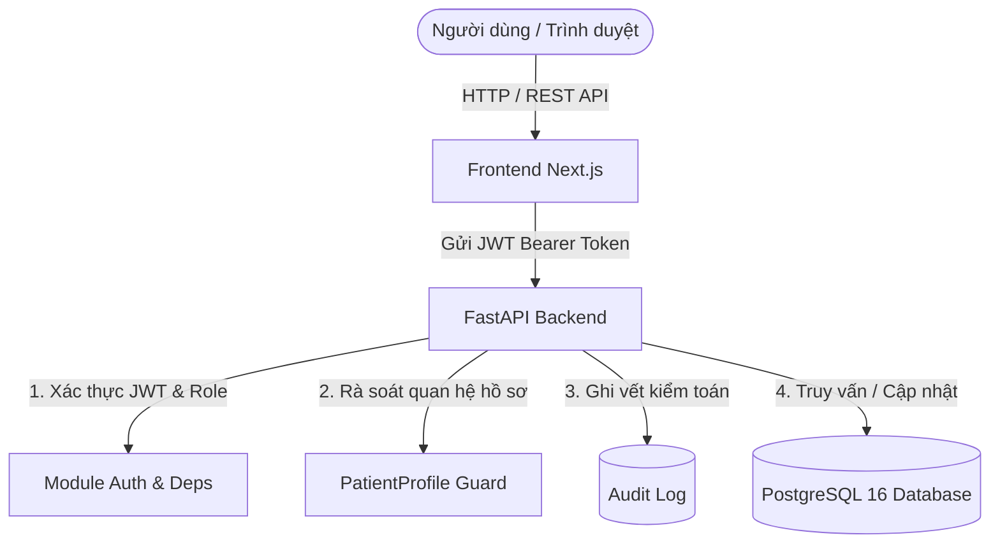
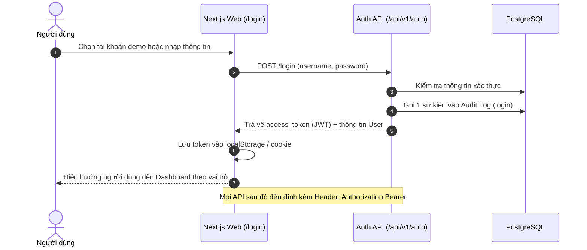
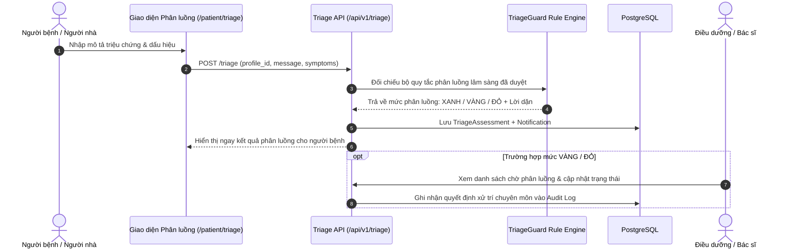
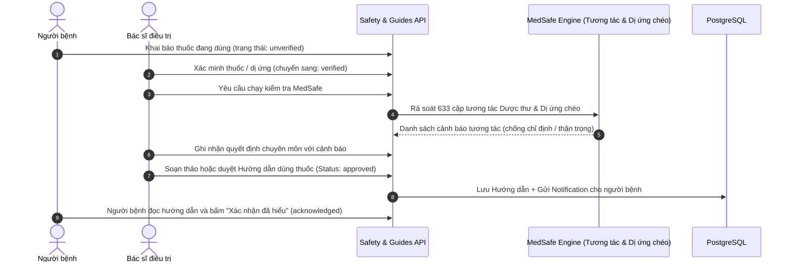
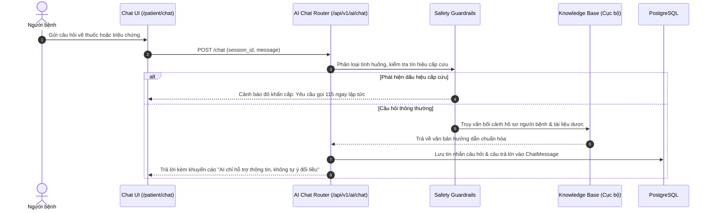

# AllerCare V2 — Báo cáo Chức năng & Hướng dẫn Kiểm thử

> **Cập nhật ngày:** 03 tháng 10 năm 2026  
> **Phiên bản:** AllerCare V2 (Next.js + FastAPI + PostgreSQL trên Docker / .NET Aspire)


---

> [!WARNING]
> **CẢNH BÁO PHẠM VI SỬ DỤNG Y KHOA**  
> AllerCare V2 là phiên bản **thử nghiệm (MVP demo)** sử dụng **toàn bộ dữ liệu giả lập**.  
> - Luồng phân luồng khẩn cấp (mức Đỏ) trong giao diện luôn yêu cầu người dùng **gọi ngay 115** hoặc di chuyển ngay đến cơ sở y tế gần nhất.  
> - Hệ thống **không thay thế chẩn đoán, quyết định điều trị hay chăm sóc y tế thực tế** của bác sĩ chuyên khoa.

---

## 1. Giới thiệu dự án

**AllerCare V2** là nền tảng số hỗ trợ theo dõi từ xa và an toàn sử dụng thuốc cho người bệnh chuyên khoa Da liễu – Miễn dịch Dị ứng. Hệ thống tích hợp các công cụ tự động hóa lâm sàng bao gồm: phân luồng triệu chứng phản ứng có hại của thuốc (**TriageGuard**), rà soát tương tác và dị ứng chéo (**MedSafe**), cùng trợ lý ảo hỗ trợ thông tin dùng thuốc theo quy tắc an toàn.

---

## 2. Tổng quan nhanh

| Nội dung | Kết quả & Hiện trạng thực tế |
| :--- | :--- |
| **Nhóm người dùng** | **7 vai trò** được định nghĩa và phân quyền trong mã nguồn (`patient`, `caregiver`, `doctor`, `nurse`, `pharmacist`, `leader`, `admin`) |
| **Tài khoản demo** | **27 tài khoản** dữ liệu mẫu giả lập trong database (19 Bệnh nhân, 1 Người nhà, 2 Bác sĩ, 2 Điều dưỡng, 1 Dược sĩ, 1 Lãnh đạo, 1 Quản trị viên) |
| **Môi trường chạy** | **Docker Engine**: PostgreSQL 16 Alpine, FastAPI Backend và Next.js Frontend hoạt động ở trạng thái `healthy` |
| **Trợ lý AI** | Trợ lý phân tích theo **quy tắc (rule-based)**, **guardrail an toàn** và **kho kiến thức nội bộ cục bộ**; *chưa tích hợp gọi LLM bên ngoài* |
| **Video tư vấn** | Có sẵn API quản lý lịch hẹn và room; binary LiveKit hiện tại là ARM64 chưa phù hợp môi trường Windows x64 |

---

## 3. Quy ước nhãn trạng thái kiểm thử

Để đảm bảo tính minh bạch và chính xác trong nghiệm thu kỹ thuật, các mục trong tài liệu này được phân loại theo 3 mức:

| Nhãn trạng thái | Định nghĩa & Ý nghĩa kỹ thuật |
| :---: | :--- |
| **`Đã kiểm thử`** | Đã được mở, chạy và xác nhận trực tiếp trong môi trường V2. Kết quả có thể quan sát rõ qua Docker, API hoặc giao diện trình duyệt. |
| **`Có trong source`** | Backend hoặc giao diện đã có mã nguồn xử lý tương ứng, nhưng chưa thực hiện trọn vẹn toàn bộ chuỗi thao tác trên UI trong lần kiểm tra này. |
| **`Chưa sẵn sàng`** | Tính năng còn giới hạn kỹ thuật hạ tầng hoặc giao diện chưa khớp quyền; chưa đủ điều kiện đưa vào kịch bản nghiệm thu chính thức. |

---

## 4. Kiến trúc hệ thống & Luồng hoạt động

Kiến trúc AllerCare V2 tách biệt hoàn toàn giữa các tầng:
- **Frontend (Next.js):** Đóng vai trò Client thuần túy, chỉ giao tiếp thông qua REST API, **không kết nối trực tiếp** đến cơ sở dữ liệu.
- **Backend (FastAPI):** Xác thực định danh qua JSON Web Token (JWT), kiểm tra ma trận phân quyền theo vai trò (Role-Based Access Control) và quan hệ hồ sơ người bệnh (`CareAssignment` / `PatientProfile`) trước khi truy xuất dữ liệu.
- **Database (PostgreSQL 16):** Lưu trữ tập trung các bảng hồ sơ, thuốc, dị ứng, quan sát triệu chứng, phân luồng, hướng dẫn và nhật ký kiểm toán y khoa (Audit Log).



---

### Sơ đồ 4 luồng nghiệp vụ chính

#### 4.1. Luồng Đăng nhập & Phân quyền (Auth Flow)



---

#### 4.2. Luồng Phân luồng triệu chứng (TriageGuard Flow)



---

#### 4.3. Luồng An toàn thuốc & Duyệt hướng dẫn (MedSafe & Guides Flow)



---

#### 4.4. Luồng Hỏi đáp AI (AI Assistant Flow)



---

## 5. Vai trò người dùng & Ma trận phân quyền

Hệ thống định nghĩa **7 vai trò**. Cơ sở dữ liệu demo chứa **27 tài khoản mẫu** nhằm phục vụ kiểm thử:

| Vai trò trong Source | Số tài khoản demo | Chức năng chính | Ranh giới & Giới hạn quyền | Trạng thái kỹ thuật |
| :--- | :---: | :--- | :--- | :---: |
| **Người bệnh (`patient`)** | **19** | • Tự khai báo thuốc, dị ứng, triệu chứng<br>• Gửi phân luồng triệu chứng (TriageGuard)<br>• Sử dụng Chat AI, tạo yêu cầu lịch hẹn<br>• Xem và xác nhận đã hiểu Hướng dẫn thuốc | Chỉ xem và thao tác trên dữ liệu của chính mình. Dữ liệu nhập ban đầu mang trạng thái *chưa xác minh*. | **Đã kiểm thử** |
| **Người nhà (`caregiver`)** | **1** | • Hỗ trợ khai báo tình trạng thay cho người bệnh đã được liên kết ủy quyền | Chỉ thao tác trong phạm vi hồ sơ người bệnh được ủy quyền. | **Có trong source** *(UI chuyển hướng sang /patient)* |
| **Bác sĩ (`doctor`)** | **2** | • Xem danh sách ca bệnh được phân công<br>• Xác minh thuốc, dị ứng, triệu chứng<br>• Kê đơn, chỉnh sửa, xóa đơn thuốc điều trị<br>• Chạy MedSafe, xử lý cảnh báo, duyệt hướng dẫn<br>• Xác nhận lịch hẹn tư vấn | Chỉ truy cập bệnh nhân được phân công phụ trách. Là vai trò duy nhất có quyền duyệt hướng dẫn thuốc và ghi quyết định cuối cùng. | **Đã kiểm thử** |
| **Điều dưỡng (`nurse`)** | **2** | • Theo dõi hàng đợi phân luồng triệu chứng mức Vàng<br>• Xác nhận hoặc điều chỉnh kết quả phân luồng<br>• Xem tóm tắt AI và dữ liệu lâm sàng qua API | Không có quyền xác minh thuốc/dị ứng, không duyệt hướng dẫn thuốc, không đặt lịch hay sửa quy tắc an toàn. | **Chưa hoàn thành** |
| **Dược sĩ (`pharmacist`)** | **1** | • Chạy rà soát an toàn MedSafe<br>• Soạn thảo bản nháp hướng dẫn thuốc<br>• Quản lý quy tắc an toàn (chuyển đổi `draft` ↔ `approved`) | Không xác minh hồ sơ bệnh nhân, không duyệt hướng dẫn thuốc cuối cùng, không ghi quyết định lâm sàng. | **Chưa hoàn thành** *(UI chuyển hướng sang /doctor)* |
| **Lãnh đạo khoa (`leader`)** | **1** | • Xem Quality Dashboard tổng hợp chỉ số chuyên môn: số ca phân luồng, cảnh báo tương tác thuốc, thời gian phản hồi | Không được truy cập hồ sơ chi tiết theo từng người bệnh. Dashboard chỉ cung cấp dữ liệu thống kê tổng hợp. | **Có trong source** |
| **Quản trị viên (`admin`)** | **1** | • Quản trị tài khoản: liệt kê, kích hoạt hoặc khóa tài khoản khác<br>• Tra cứu 100 sự kiện nhật ký kiểm toán (Audit Event) gần nhất | Không có quyền truy cập hồ sơ bệnh án lâm sàng; không thể tự khóa chính mình. | **Có trong source** |

---

## 6. Hướng dẫn thiết lập môi trường kiểm thử

### 6.1. Các bước khởi động hệ thống qua Docker

1. **Mở Docker Desktop** và đảm bảo Docker Engine ở trạng thái *Running*.
2. **Mở Terminal** tại thư mục gốc của dự án:
   ```bash
   cd /Users/macbook/AllerCare_AI_V2
   ```
3. **Khởi động các dịch vụ bằng Docker Compose (Môi trường Sản phẩm / Smoke Test):**
   ```bash
   docker compose -p allercare-v2-smoke --env-file infra/.env.prod -f infra/docker-compose.prod.yml up -d
   ```
4. **Kiểm tra trạng thái các container:**
   ```bash
   docker compose -p allercare-v2-smoke ps
   ```
5. **Truy cập các địa chỉ dịch vụ:**
   - **Giao diện Web:** `http://localhost:3001/login` (hoặc cổng cấu hình trong file env)
   - **API Health Check:** `http://localhost:8001/api/v1/healthz` (API trả về JSON: `{"status":"ok","demo_mode":true}`)

---

> [!IMPORTANT]
> **LƯU Ý QUAN TRỌNG VỀ DỮ LIỆU & KIỂM THỬ**
> 1. **Cấu hình `SEED_ON_START=0`:** Đã được thiết lập trong môi trường sản phẩm để bảo vệ dữ liệu đã lưu, tránh tình trạng tự động reset dữ liệu sau mỗi lần container khởi động lại.
> 2. **Không dùng Compose Development khi kiểm thử:** File compose development mặc định kích hoạt seed lại dữ liệu demo, làm mất dữ liệu đã thao tác trong các phiên test trước.
> 3. **Bảo vệ Volume Cơ sở dữ liệu:** Tuyệt đối **không chạy** các lệnh phá hủy dữ liệu như:
>    - `docker compose down -v`
>    - `docker volume rm allercare_pgdata_prod`  
>    trừ khi bạn đã thực hiện sao lưu (backup) cơ sở dữ liệu trước đó.

---

## 7. Kịch bản kiểm thử mẫu theo vai trò

Dưới đây là 10 kịch bản kiểm thử theo đúng quy trình phân quyền:

| STT | Kịch bản kiểm thử | Hướng dẫn thao tác | Kết quả mong đợi cần quan sát | Trạng thái |
| :---: | :--- | :--- | :--- | :---: |
| **01** | **Đăng nhập Người bệnh** | Tại trang `/login`, bấm nút chọn nhanh `patient1` (Lê Văn Cường) để tự động điền thông tin, sau đó bấm *Đăng nhập*. | Chuyển hướng đến `/patient`, hiển thị đúng họ tên, thuốc đang dùng, tiền sử dị ứng, hướng dẫn thuốc và thanh điều hướng. | **Đã kiểm thử** |
| **02** | **Khai báo Phân luồng (Triage)** | Đăng nhập tài khoản bệnh nhân, vào mục *Phân luồng* (`/patient/triage`). Nhập mô tả triệu chứng demo không khẩn cấp (ví dụ: *"ngứa nhẹ mu bàn tay sau uống thuốc 2 giờ"*), gửi khai báo. | Hệ thống lưu assessment mới, hiển thị kết quả phân loại mức Xanh/Vàng/Đỏ theo rule và hiển thị trong danh sách lịch sử. | **Có trong source** |
| **03** | **Cập nhật dữ liệu Hồ sơ** | Vào mục *Cập nhật* (`/patient/updates`) để thêm thuốc đang dùng, triệu chứng mới hoặc dị ứng mới bằng dữ liệu giả lập. | Bản ghi mới xuất hiện trong hồ sơ với trạng thái `unverified` (chưa xác minh) và hiển thị trong danh sách chờ bác sĩ duyệt. | **Có trong source** |
| **04** | **Hỏi đáp Trợ lý AI** | Vào mục *Hỏi đáp AI* (`/patient/chat`), tạo phiên hội thoại mới và chọn câu hỏi mẫu về cách dùng thuốc hoặc tương tác. | Trợ lý phản hồi thông tin dựa trên kho kiến thức dược cục bộ, ghi nhận phiên chat vào lịch sử. Không đóng vai trò thay thế bác sĩ. | **Có trong source** |
| **05** | **Yêu cầu Lịch hẹn khám** | Vào mục *Lịch hẹn* (`/patient/appointments`), chọn khung giờ và nhập lý do khám mẫu, bấm gửi yêu cầu. | Yêu cầu tạo mới thành công ở trạng thái `pending`. Khi bác sĩ xác nhận, trạng thái chuyển sang `confirmed`. | **Có trong source** |
| **06** | **Bác sĩ xác minh dữ liệu** | Đăng nhập `doctor1`, chọn một ca bệnh được phân công, thực hiện bấm nút *Xác minh* trên thuốc hoặc tiền sử dị ứng. | Trạng thái bản ghi chuyển từ `unverified` sang `verified` (có huy hiệu xanh) và hệ thống ghi lại sự kiện vào Audit Log. | **Có trong source** |
| **07** | **Rà soát an toàn MedSafe** | Trong giao diện Bác sĩ hoặc Dược sĩ, mở chi tiết hồ sơ bệnh nhân và kích hoạt kiểm tra MedSafe. | Hiển thị danh sách cảnh báo tương tác thuốc / dị ứng chéo theo danh mục Dược thư; Bác sĩ có thể nhập ghi chú quyết định lâm sàng. | **Có trong source** |
| **08** | **Quy trình Hướng dẫn thuốc** | Bác sĩ soạn thảo bản nháp hướng dẫn thuốc, duyệt chuyển sang `approved`. Đăng nhập lại tài khoản bệnh nhân để xem. | Người bệnh thấy hướng dẫn mới trong danh mục, bấm nút *Xác nhận đã hiểu* và trạng thái cập nhật thành `acknowledged`. | **Có trong source** |
| **09** | **Lãnh đạo & Quản trị viên** | Đăng nhập `leader1` hoặc `admin1` từ nút chọn nhanh tại màn hình login. | • `leader1`: Xem các biểu đồ và chỉ số chất lượng tổng hợp (không thấy hồ sơ cá nhân).<br>• `admin1`: Xem danh sách user, audit log (không xem bệnh án). | **Có trong source** |
| **10** | **Tư vấn Video Call** | Mở phòng tư vấn video qua link hẹn. | Khung backend tạo room/token hoạt động, nhưng binary LiveKit hiện tại là ARM64 nên chưa sẵn sàng trên nền tảng Windows x64. | **Chưa sẵn sàng** |

> [!TIP]
> **Đăng nhập nhanh 1-Click:** Trên giao diện `/login`, hệ thống đã tích hợp sẵn danh sách các nút chọn nhanh tài khoản demo cho từng vai trò (`patient1`, `case02`, `doctor1`, `nurse1`, `pharmacist1`, `leader1`, `admin1`, `family1`). Khuyến khích sử dụng các nút này để tránh việc phải ghi nhớ hoặc nhập mật khẩu thủ công.

---

## 8. Kết quả đã kiểm thử thực tế trên hệ thống

Bảng sau ghi nhận các hạng mục đã được kiểm tra trực tiếp trên môi trường Docker V2:

| Hạng mục kiểm tra | Bằng chứng kỹ thuật & Kết quả quan sát | Trạng thái |
| :--- | :--- | :---: |
| **Docker Engine** | Docker Server phản hồi phiên bản `29.8.0` hoạt động bình thường, quản lý đầy đủ các container của dự án. | **Đã kiểm thử** |
| **Cơ sở dữ liệu PostgreSQL** | Container `allercare-prod-postgres` chạy ổn định; truy vấn trực tiếp xác nhận có **27 tài khoản user** và **19 hồ sơ bệnh nhân** demo. | **Đã kiểm thử** |
| **Backend API Health** | Endpoint `GET /api/v1/healthz` phản hồi HTTP 200: `{"status": "ok", "demo_mode": true}`. | **Đã kiểm thử** |
| **Màn hình Đăng nhập Web** | Trang `/login` tải đầy đủ giao diện, không xuất hiện màn hình báo lỗi (Error Overlay) hay lỗi console. | **Đã kiểm thử** |
| **Dashboard Bệnh nhân** | Đăng nhập `patient1` thành công; hiển thị chi tiết hồ sơ bệnh nhân, danh sách thuốc, dị ứng, hướng dẫn thuốc và thanh menu. | **Đã kiểm thử** |
| **Màn hình Phân luồng** | Trang `/patient/triage` tải form khai báo triệu chứng và hiển thị danh sách lịch sử phân luồng đã lưu. | **Đã kiểm thử** |
| **Màn hình Hỏi đáp AI** | Trang `/patient/chat` tải thành công giao diện chat, khung câu hỏi gợi ý và ô nhập câu hỏi. | **Đã kiểm thử** |
| **Màn hình Lịch hẹn** | Trang `/patient/appointments` tải form đặt lịch hẹn và hiển thị danh sách các cuộc hẹn hiện có. | **Đã kiểm thử** |
| **Hạ tầng Video LiveKit** | Backend có mã nguồn tạo token và room, nhưng binary LiveKit đóng gói là ARM64 nên chưa tương thích hệ điều hành Windows x64. | **Chưa sẵn sàng** |

---

## 9. Các giới hạn kỹ thuật đã biết

Nhằm đảm bảo tính khách quan cho quá trình nghiệm thu, dưới đây là các giới hạn kỹ thuật hiện tại cần lưu ý:

1. **Bản chất của Trợ lý AI:** Mã nguồn hiện tại sử dụng **Mock Adapter** kết hợp bộ lọc quy tắc (Guardrails) và kho tri thức dược cục bộ. Hệ thống **chưa kết nối với các mô hình ngôn ngữ lớn (LLM)** bên ngoài như OpenAI GPT hay Google Gemini API.
2. **Giao diện Người nhà (`caregiver`):** Backend có hỗ trợ phân quyền người nhà, tuy nhiên giao diện Frontend hiện đang điều hướng người nhà vào trang `/patient`, dẫn đến một số thao tác có thể không hoàn toàn khớp quyền.
3. **Điều hướng Dược sĩ (`pharmacist`):** Sau khi đăng nhập, tài khoản dược sĩ hiện bị điều hướng sang trang `/doctor` thay vì `/pharmacist`. Một số thao tác có thể nhận phản hồi HTTP 403 Forbidden dù backend dược sĩ có bộ endpoint riêng (`/api/v1/rules`).
4. **Nút Thêm thuốc dự kiến ở màn hình Bác sĩ:** Nút thêm thuốc dự kiến trên giao diện bác sĩ hiện gọi endpoint dành cho người bệnh/người nhà, do đó có thể trả về lỗi 403 khi bác sĩ thao tác.
5. **Chuyển tiếp hỗ trợ (Handoff) trong Chat AI:** AI có thể tạo nội dung thông báo handoff trong lịch sử hội thoại, nhưng hệ thống hiện **chưa kích hoạt tạo `Notification` thực tế** gửi vào hàng đợi của Bác sĩ hoặc Điều dưỡng.
6. **Xử lý hình ảnh lâm sàng:** Chưa có module upload và phân tích thị giác hình ảnh; trường `image_url` hiện tại chỉ lưu trữ chuỗi văn bản đường dẫn.
7. **Video Call LiveKit:** Binary LiveKit đóng gói trong mã nguồn là phiên bản Linux ARM64, không chạy trực tiếp trên môi trường Windows x64 mà không qua chuyển đổi container tương thích.

---

## 10. Danh mục tài liệu & Mã nguồn đối chiếu

Các số liệu và quy trình trong tài liệu này được đối chiếu trực tiếp với các tệp nguồn sau trong repository:

- **Dữ liệu tài khoản & Hồ sơ demo:**
  - [`data/demo/accounts.json`](file:///Users/macbook/AllerCare_AI_V2/data/demo/accounts.json)
  - [`services/api/app/modules/patients/models.py`](file:///Users/macbook/AllerCare_AI_V2/services/api/app/modules/patients/models.py)
- **Kiểm soát xác thực & Phân quyền:**
  - [`services/api/app/modules/auth/deps.py`](file:///Users/macbook/AllerCare_AI_V2/services/api/app/modules/auth/deps.py)
  - [`services/api/app/main.py`](file:///Users/macbook/AllerCare_AI_V2/services/api/app/main.py)
- **Các Routers chức năng Backend:**
  - `services/api/app/modules/patients/router.py` & `doctor_router.py`
  - `services/api/app/modules/safety/router.py` & `pharmacist_router.py`
  - `services/api/app/modules/triage/router.py`
  - `services/api/app/modules/guides/router.py`
  - `services/api/app/modules/ai/chat_router.py`
  - `services/api/app/modules/consultations/router.py`
  - `services/api/app/modules/notifications/router.py`
  - `services/api/app/modules/dashboard/router.py`
  - `services/api/app/modules/admin/router.py`
- **Cấu hình Triển khai & Khởi động Docker:**
  - [`infra/docker-compose.prod.yml`](file:///Users/macbook/AllerCare_AI_V2/infra/docker-compose.prod.yml)
  - `infra/.env.prod`
  - `services/api/entrypoint.sh`
- **Giao diện Client & Đăng nhập:**
  - [`apps/web/lib/api.ts`](file:///Users/macbook/AllerCare_AI_V2/apps/web/lib/api.ts)
  - [`apps/web/app/login/page.tsx`](file:///Users/macbook/AllerCare_AI_V2/apps/web/app/login/page.tsx)
